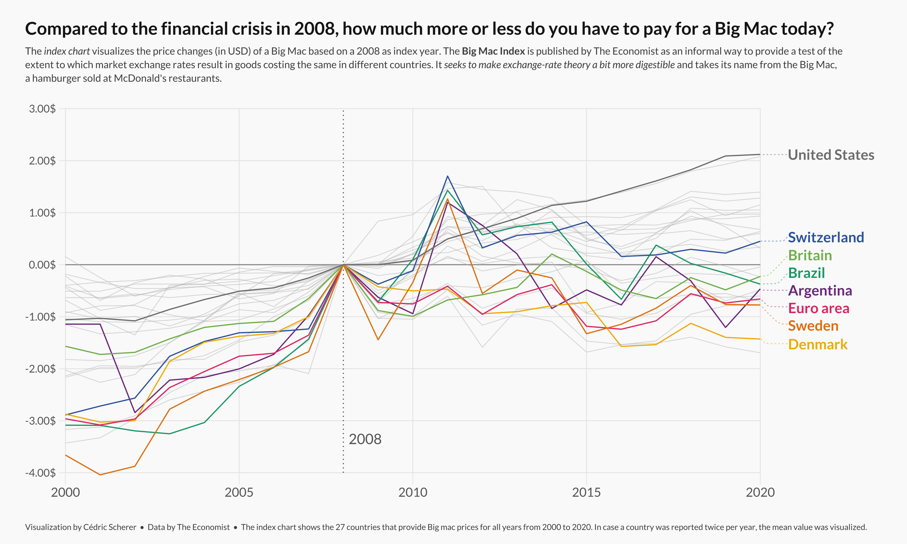
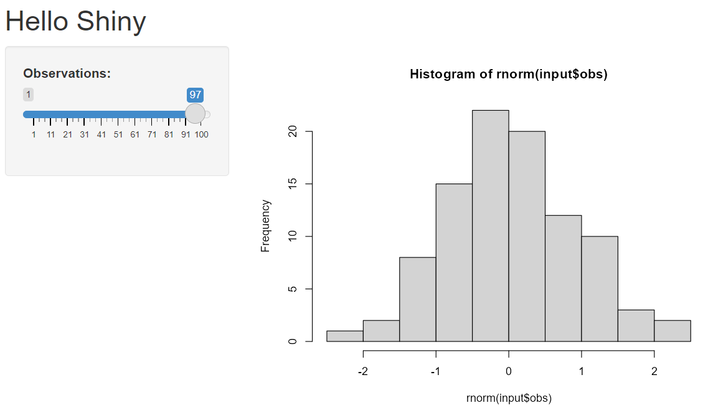
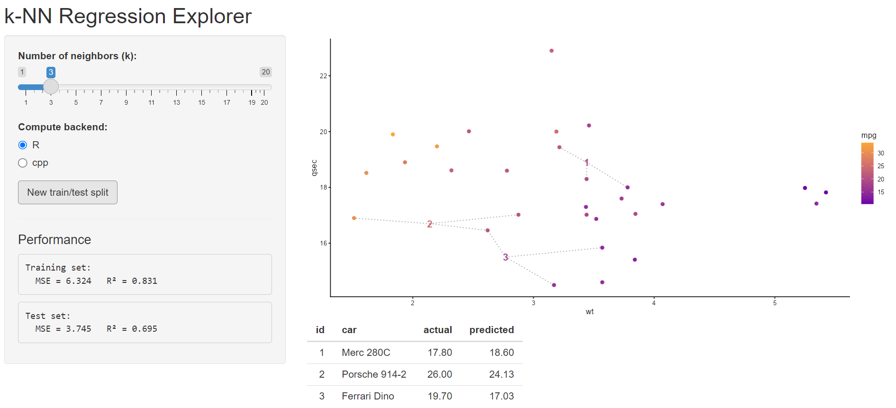

# Data visualization in ggplot2 

```{=html}
<style>
.top-aligned {
  top: 0 !important;
}
</style>
```

The `ggplot2` package, a part of the `tidyverse`, is the go-to software for data visualization in R.

-   Since its release in June of 2007, it has received over 18 million downloads on CRAN.
-   It is based on the grammar of graphics, a scheme for data visualization that deconstructs graphs into components such as layers.

# An example {.top-aligned}



Source: [Cedric Scherer](https://r-graph-gallery.com/web-line-chart-with-labels-at-end-of-line.html)

# Dataset {.top-aligned}

We will be working with `mtcars`, a dataset that comes preinstalled with R.

-   In particular, we are interested in how `wt` and `qsec` are related to `mpg`.

:::: my-mtcars
::: panel-tabset
## Code

```{r}
#| label: mtcars
#| eval: false

head(mtcars)
```

## Output

```{=html}
<style>
.my-mtcars .cell-output pre {
  font-size: 0.65em;
  background-color: inherit;
}
</style>
```

```{r}
#| echo: false
#| comment: ""

head(mtcars)
```
:::
::::

# ggplot basics {.top-aligned}

Every ggplot starts with a `ggplot()` statement.

-   This just generates a blank canvas for you to work on.

::: panel-tabset
## Code

```{r}
#| label: basic
#| fig-show: hide
#| message: false
library(ggplot2)

ggplot()
```

## Plot

```{r}
#| ref.label: basic
#| echo: false
#| fig-asp: 0.3
```
:::

# Layering in ggplot2 {.top-aligned}

You may add *layers* to your plot using the `+` symbol.

-   For a scatter plot, we use the `geom_point()` layer.

Every geom requires two arguments:

-   `mapping` - a set of aesthetic mappings created by `aes()`
    -   The `aes()` function describes how each variable in the data maps to visual elements of the plot.
    -   For `geom_point()`, set the arguments `x` and `y` in `aes()` to column names in your dataset.
-   `data` - the data to be displayed in this layer.

# Adding geom_point() {.top-aligned}

::: panel-tabset
## Code

```{r}
#| label: geom_point
#| fig-show: hide
#| message: false

ggplot() +
  geom_point(aes(x = wt, y = qsec), data = mtcars)
```

## Plot

```{r}
#| ref.label: geom_point
#| echo: false
#| fig-asp: 0.5
```
:::

# Customizing geoms {.top-aligned}

::: panel-tabset
## Code

```{r}
#| label: geom_point2
#| message: false
#| fig-show: hide

ggplot() +
  geom_point(aes(x = wt, y = qsec), 
             color = "blue", data = mtcars)

```

## Plot

```{r}
#| ref.label: geom_point2
#| echo: false
#| fig-asp: 0.5
```
:::

# Adding aesthetics {.top-aligned}

We now represent the third variable, `mpg`, through the color option.

::: panel-tabset
## Code

```{r}
#| label: geom_point3
#| message: false
#| fig-show: hide

ggplot() +
  geom_point(aes(x = wt, y = qsec, color = mpg), data = mtcars)

```

## Plot

```{r}
#| ref.label: geom_point3
#| echo: false
#| fig-asp: 0.45
```
:::

# Additional customization {.top-aligned}

::: panel-tabset
## Code

```{r}
#| label: geom_point4
#| message: false
#| fig-show: hide

ggplot() +
  geom_point(aes(x = wt, y = qsec, color = mpg), 
             data = mtcars) +
  scale_color_gradient(low = "#6A00A8FF", high = "#FCA636FF") +
  theme_classic()

```

## Plot

```{r}
#| ref.label: geom_point4
#| echo: false
#| fig-asp: 0.45
```
:::

# Adding geoms {.top-aligned}

We now observe a car with `wt = 2`, `qsec = 20` and `mpg = ?`.

::: panel-tabset
## Code

```{r}
#| label: geom_point5
#| message: false
#| fig-show: hide

new_car = data.frame(wt = 2, qsec = 20)

ggplot() +
  geom_point(aes(x = wt, y = qsec, color = mpg), 
             data = mtcars) +
  geom_point(aes(x = wt, y = qsec), shape = 13, 
             data = new_car) +
  scale_color_gradient(low = "#6A00A8FF", high = "#FCA636FF") +
  theme_classic()
```

## Plot

```{r}
#| ref.label: geom_point5
#| echo: false
#| fig-asp: 0.45
```
:::

# Prediction {.top-aligned}

We predict `mpg` using $k$ nearest neighbors regression (knn).

```{r}
#| label: knn_pred
#| echo: false
knn_pred <- function(train_x, train_y, test_x, k) {
  # Coerce types
  train_x <- as.matrix(train_x)
  test_x  <- as.matrix(test_x)
  train_y <- as.numeric(train_y)
  
  # Scale train and test appropriately
  train_x <- scale(train_x)
  # Extract the mean and sd used
  train_mean <- attr(train_x, "scaled:center")
  train_sd <- attr(train_x, "scaled:scale")
  
  # Apply the same transformation to test data
  test_x <- scale(test_x, center = train_mean, scale = train_sd)
  
  n <- nrow(train_x) 
  p <- ncol(train_x)
  m <- nrow(test_x)
  
  # Store predictions
  preds <- numeric(m)
  # Store ids of k nearest neighbors
  ids <- numeric(m * k)
  
  for (j in seq_len(m)) {
    
    # Squared Euclidean distances using matrix ops (fast):
    # t(train_x) is p x n; subtract p-vector test_x[j,]; colSums -> length n
    dists <- colSums((t(train_x) - test_x[j, ])^2)
    
    # Indices of k smallest distances (full sort, simple & reliable)
    idx_k <- order(dists)[seq_len(k)]
    
    # Mean of neighbor labels
    preds[j] <- mean(train_y[idx_k])
    
    # Store ids of nearest neighbors
    # ids of vars
    ids[((j-1) * k + 1):(j * k)] <- idx_k
  }
  
  out = list("preds" = preds, "ids" = ids)
  
  out
}
```

```{r}
#| echo: false  

segment_df <- function(train_x, test_x, ids, k){
  train_x <- as.matrix(train_x)
  test_x  <- as.matrix(test_x)
  
  n <- nrow(train_x); p <- ncol(train_x); m <- nrow(test_x)
  
  # Create df with each test point alongside k nearest neighbors
  test_x_out = test_x[rep(1:m, each = k), ]
  train_x_out = train_x[ids, ]
  out = as.data.frame(cbind(test_x_out, train_x_out))
  colnames(out) <- c(paste0("test_", colnames(train_x)), 
                     paste0("train_", colnames(train_x)))
  out
}
```

```{r}
#| label: knn
#| echo: false
#| fig-asp: 0.5

k = 3

new_car = data.frame(wt = 2, qsec = 20)

preds <- knn_pred(mtcars[, c("wt", "qsec")], mtcars[, "mpg"], 
                  new_car, k)

nn <- segment_df(mtcars[, c("wt", "qsec")], new_car,
                 preds$ids, k)

new_car$pred <- preds$pred

ggplot() +
  geom_segment(aes(x = test_wt, xend = train_wt,
                   y = test_qsec, yend = train_qsec), 
               color = "grey50", linetype = "dotted", data = nn) +
  geom_point(aes(x = wt, y = qsec, color = mpg), 
             data = mtcars) +
  geom_point(aes(x = wt, y = qsec, color = pred), 
             data = new_car) +
  scale_color_gradient(low = "#6A00A8FF", high = "#FCA636FF") +
  theme_classic() +
  labs(x = 'wt', y = 'qsec')
```

# knn helper function

``` {.r code-line-numbers="1-1|2-5|7-13|15-22|24-39|41-43"}
knn_pred <- function(train_x, train_y, test_x, k) {
  # Coerce types
  train_x <- as.matrix(train_x)
  test_x  <- as.matrix(test_x)
  train_y <- as.numeric(train_y)
  
  # Scale train and test appropriately
  train_x <- scale(train_x)
  # Extract the mean and sd used
  train_mean <- attr(train_x, "scaled:center")
  train_sd <- attr(train_x, "scaled:scale")
  # Apply the same transformation to test data
  test_x <- scale(test_x, center = train_mean, scale = train_sd)
  
  n <- nrow(train_x) 
  p <- ncol(train_x)
  m <- nrow(test_x)
  
  # Store predictions
  preds <- numeric(m)
  # Store ids of k nearest neighbors
  ids <- numeric(m * k)
  
  for (j in seq_len(m)) {
    
    # Squared Euclidean distances using matrix ops (fast):
    # t(train_x) is p x n; subtract p-vector test_x[j,]; colSums -> length n
    dists <- colSums((t(train_x) - test_x[j, ])^2)
    
    # Indices of k smallest distances (full sort, simple & reliable)
    idx_k <- order(dists)[seq_len(k)]
    
    # Mean of neighbor labels
    preds[j] <- mean(train_y[idx_k])
    
    # Store ids of nearest neighbors
    # ids of vars
    ids[((j-1) * k + 1):(j * k)] <- idx_k
  }
  
  out = list("preds" = preds, "ids" = ids)
  
  out
}
```

# geom_segment() helper function

``` {.r code-line-numbers="1-1|2-5|7-13"}
segment_df <- function(train_x, test_x, ids, k){
  train_x <- as.matrix(train_x)
  test_x  <- as.matrix(test_x)
  
  n <- nrow(train_x); p <- ncol(train_x); m <- nrow(test_x)
  
  # Create df with each test point alongside k nearest neighbors
  test_x_out = test_x[rep(1:m, each = k), ]
  train_x_out = train_x[ids, ]
  out = as.data.frame(cbind(test_x_out, train_x_out))
  colnames(out) <- c(paste0("test_", colnames(train_x)), 
                     paste0("train_", colnames(train_x)))
  out
}
```

# Applying helper functions

:::: my-helpers
::: panel-tabset
## Code

```{r}
#| label: helpers
#| eval: false
k = 3

new_car = data.frame(wt = 2, qsec = 20)

preds <- knn_pred(mtcars[, c("wt", "qsec")], mtcars[, "mpg"], 
                  new_car, k)

nn <- segment_df(mtcars[, c("wt", "qsec")], new_car,
                 preds$ids, k)

new_car$pred <- preds$pred
```

## Output

```{=html}
<style>
.my-helpers .cell-output pre {
  font-size: 0.65em;
  background-color: inherit;
}
</style>
```

```{r}
#| echo: false
#| comment: ""
k = 3

new_car = data.frame(wt = 2, qsec = 20)

preds <- knn_pred(mtcars[, c("wt", "qsec")], mtcars[, "mpg"], 
                  new_car, k)

nn <- segment_df(mtcars[, c("wt", "qsec")], new_car,
                 preds$ids, k)

new_car$pred <- preds$pred
```

```{r}
nn

new_car
```
:::
::::

# Adding geom_segment() {.top-aligned}

::: panel-tabset
## Code

```{r}
#| label: final_plot
#| message: false
#| fig-show: hide

ggplot() +
  geom_segment(aes(x = test_wt, xend = train_wt,
                   y = test_qsec, yend = train_qsec), 
               color = "grey50", linetype = "dotted", 
               data = nn) +
  geom_point(aes(x = wt, y = qsec, color = mpg), 
             data = mtcars) +
  geom_point(aes(x = wt, y = qsec, color = pred), 
             data = new_car) +
  scale_color_gradient(low = "#6A00A8FF", high = "#FCA636FF") +
  theme_classic() +
  labs(x = 'wt', y = 'qsec')
```

## Plot

```{r}
#| ref.label: final_plot
#| echo: false
#| fig-asp: 0.5
```
:::

# Structure of a Shiny App 

::: shrink-code
``` {.r code-line-numbers="1-2|3-5|7-9|11" height="200"}
# app.R single-file app
library(shiny)
ui <- fluidPage(
  ...
)

server <- function(input, output) {
  ...
}

shinyApp(ui, server)
```
:::

-   `ui` defines layout and inputs/outputs

-   `server` contains R code & reactivity

## Hello Shiny App




## Structure of a Shiny App 

::: shrink-code
``` {.r code-line-numbers="1-2|3-9|11-15|17" height="200"}
# app.R single-file app
library(shiny)
ui <- fluidPage(
  titlePanel("Hello Shiny"),
  sidebarLayout(
    sidebarPanel(sliderInput("obs", "Observations:", 1, 100, 50)),
    mainPanel(plotOutput("distPlot"))
  )
)

server <- function(input, output) {
  output$distPlot <- renderPlot({
    hist(rnorm(input$obs))
  })
}

shinyApp(ui, server)
```
:::

-   `ui` defines layout and inputs/outputs

-   `server` contains R code & reactivity

## Structure of a Shiny App 

Shiny apps come in two parts:

::::: columns
::: {.column}
### UI

-   Defines the layout and appearance.

-   Contains elements such as:

    -   layout structures (sidebars)
    -   inputs (text boxes, sliders, buttons)
    -   outputs (plots, tables)
:::

::: {.column}
### Server

-   Performs calculations.

-   Contains the logic to respond to user inputs, and update outputs.

-   Communicates with the UI to dynamically render outputs.
:::
:::::

## k-NN Regression Explorer {.top-aligned}



## Train/test helper 

``` {.r}
make_split <- function(data, prop = 0.7) {
  n <- nrow(data)
  train_idx <- sample(n, size = floor(prop * n))
  list(train = data[train_idx, ], test = data[-train_idx, ])
}
```

* We use this function to split the `mtcars` data into a train and test set.

## UI

::: shrink-code
``` {.r code-line-numbers="2-2|3-19|5-6|9" height="200"}
ui <- fluidPage(
  titlePanel("k-NN Regression Explorer"),
  sidebarLayout(
    sidebarPanel(
      sliderInput("k", "Number of neighbors (k):",
                  min = 1, max = 20, value = 5, step = 1),
      radioButtons("backend", "Compute backend:",
                   choices = c("R","cpp"), selected = "cpp"),
      actionButton("resample", "New train/test split"),
      hr(),
      h4("Performance"),
      verbatimTextOutput("trainPerf"),
      verbatimTextOutput("testPerf")
    ),
    mainPanel(
      plotOutput("predPlot", height = "400px"),
      tableOutput("predTable")
    )
  )
)
```
:::


## Server (part one)

::: shrink-code
``` {.r code-line-numbers="3-5" height="200"}
server <- function(input, output, session) {
  # reactive train/test split, re-draw when resample pressed
  split <- eventReactive(input$resample, {
    make_split(mtcars, prop = 0.92)
  }, ignoreNULL = FALSE)
  
  # compute fitted (train) and predicted (test)
  fitted_vals <- reactive({
    d_train <- split()$train
    knn_pred(d_train[, c("wt", "qsec")], d_train[, c("mpg")], 
             d_train[, c("wt", "qsec")], input$k, input$backend)
  })
  predicted <- reactive({
    d_train <- split()$train
    d_test <- split()$test
    knn_pred(d_train[, c("wt", "qsec")], d_train[, c("mpg")], 
             d_test[, c("wt", "qsec")], input$k, input$backend)
  })
  
  # compute metrics
  mse <- function(obs, pred) mean((obs - pred)^2)
  r2  <- function(obs, pred) 1 - (sum((obs - pred)^2) / sum((obs - mean(obs))^2))
  
  output$trainPerf <- renderPrint({
    obs <- split()$train$mpg
    cat("Training set:\n")
    cat("  MSE =", round(mse(obs, fitted_vals()$preds), 3),
        "  R² =", round(r2(obs, fitted_vals()$preds), 3), "\n")
  })
  output$testPerf <- renderPrint({
    obs <- split()$test$mpg
    cat("Test set:\n")
    cat("  MSE =", round(mse(obs, predicted()$preds), 3),
        "  R² =", round(r2(obs, predicted()$preds), 3), "\n")
  })
  
  # Plot showing the k nearest neighbors for each test point
  output$predPlot <- renderPlot({
    # Store train/test
    d_train <- split()$train
    d_test <- split()$test
    d_test$id = 1:nrow(d_test)
    
    # Create df for geom_segment 
    nn <- segment_df(d_train[, c("wt", "qsec")], 
                     d_test[, c("wt", "qsec")], 
                     predicted()$ids, input$k)
    
    # Add predictions for test set
    d_test$pred <- predicted()$preds
    
    # Create the plot
    ggplot() +
      geom_segment(aes(x = test_wt, xend = train_wt, 
                       y = test_qsec, yend = train_qsec), 
                   color = "grey50", linetype = "dotted",
                   data = nn) +
      geom_point(aes(x = wt, y = qsec, color = mpg), 
                 size = 2, data = d_train) +
      geom_text(aes(x = wt, y = qsec, color = pred, label = id), 
                size = 5, fontface = "bold", data = d_test) +
      scale_color_gradient(low = "#6A00A8FF", high = "#FCA636FF") +
      theme_classic() +
      labs(x = "wt", y = "qsec")
  })
  
  # show first few test observations
  output$predTable <- renderTable({
    d_test <- split()$test
    data.frame(
      id = 1:nrow(d_test),
      car = rownames(d_test),
      actual = round(d_test$mpg,2),
      predicted = round(predicted()$preds,2)
    )
  }, rownames = FALSE)
}
```
:::

* `eventReactive()` updates in response to a specific event (i.e. button push).

## Server (part two)

::: shrink-code
``` {.r code-line-numbers="7-18" height="200"}
server <- function(input, output, session) {
  # reactive train/test split, re-draw when resample pressed
  split <- eventReactive(input$resample, {
    make_split(mtcars, prop = 0.92)
  }, ignoreNULL = FALSE)
  
  # compute fitted (train) and predicted (test)
  fitted_vals <- reactive({
    d_train <- split()$train
    knn_pred(d_train[, c("wt", "qsec")], d_train[, c("mpg")], 
             d_train[, c("wt", "qsec")], input$k, input$backend)
  })
  predicted <- reactive({
    d_train <- split()$train
    d_test <- split()$test
    knn_pred(d_train[, c("wt", "qsec")], d_train[, c("mpg")], 
             d_test[, c("wt", "qsec")], input$k, input$backend)
  })
  
  # compute metrics
  mse <- function(obs, pred) mean((obs - pred)^2)
  r2  <- function(obs, pred) 1 - (sum((obs - pred)^2) / sum((obs - mean(obs))^2))
  
  output$trainPerf <- renderPrint({
    obs <- split()$train$mpg
    cat("Training set:\n")
    cat("  MSE =", round(mse(obs, fitted_vals()$preds), 3),
        "  R² =", round(r2(obs, fitted_vals()$preds), 3), "\n")
  })
  output$testPerf <- renderPrint({
    obs <- split()$test$mpg
    cat("Test set:\n")
    cat("  MSE =", round(mse(obs, predicted()$preds), 3),
        "  R² =", round(r2(obs, predicted()$preds), 3), "\n")
  })
  
  # Plot showing the k nearest neighbors for each test point
  output$predPlot <- renderPlot({
    # Store train/test
    d_train <- split()$train
    d_test <- split()$test
    d_test$id = 1:nrow(d_test)
    
    # Create df for geom_segment 
    nn <- segment_df(d_train[, c("wt", "qsec")], 
                     d_test[, c("wt", "qsec")], 
                     predicted()$ids, input$k)
    
    # Add predictions for test set
    d_test$pred <- predicted()$preds
    
    # Create the plot
    ggplot() +
      geom_segment(aes(x = test_wt, xend = train_wt, 
                       y = test_qsec, yend = train_qsec), 
                   color = "grey50", linetype = "dotted",
                   data = nn) +
      geom_point(aes(x = wt, y = qsec, color = mpg), 
                 size = 2, data = d_train) +
      geom_text(aes(x = wt, y = qsec, color = pred, label = id), 
                size = 5, fontface = "bold", data = d_test) +
      scale_color_gradient(low = "#6A00A8FF", high = "#FCA636FF") +
      theme_classic() +
      labs(x = "wt", y = "qsec")
  })
  
  # show first few test observations
  output$predTable <- renderTable({
    d_test <- split()$test
    data.frame(
      id = 1:nrow(d_test),
      car = rownames(d_test),
      actual = round(d_test$mpg,2),
      predicted = round(predicted()$preds,2)
    )
  }, rownames = FALSE)
}
```
:::

* `reactive()` updates in response to _any_ input change.

## Server (part three)

::: shrink-code
``` {.r code-line-numbers="37-50|52-64" height="200"}
server <- function(input, output, session) {
  # reactive train/test split, re-draw when resample pressed
  split <- eventReactive(input$resample, {
    make_split(mtcars, prop = 0.92)
  }, ignoreNULL = FALSE)
  
  # compute fitted (train) and predicted (test)
  fitted_vals <- reactive({
    d_train <- split()$train
    knn_pred(d_train[, c("wt", "qsec")], d_train[, c("mpg")], 
             d_train[, c("wt", "qsec")], input$k, input$backend)
  })
  predicted <- reactive({
    d_train <- split()$train
    d_test <- split()$test
    knn_pred(d_train[, c("wt", "qsec")], d_train[, c("mpg")], 
             d_test[, c("wt", "qsec")], input$k, input$backend)
  })
  
  # compute metrics
  mse <- function(obs, pred) mean((obs - pred)^2)
  r2  <- function(obs, pred) 1 - (sum((obs - pred)^2) / sum((obs - mean(obs))^2))
  
  output$trainPerf <- renderPrint({
    obs <- split()$train$mpg
    cat("Training set:\n")
    cat("  MSE =", round(mse(obs, fitted_vals()$preds), 3),
        "  R² =", round(r2(obs, fitted_vals()$preds), 3), "\n")
  })
  output$testPerf <- renderPrint({
    obs <- split()$test$mpg
    cat("Test set:\n")
    cat("  MSE =", round(mse(obs, predicted()$preds), 3),
        "  R² =", round(r2(obs, predicted()$preds), 3), "\n")
  })
  
  # Plot showing the k nearest neighbors for each test point
  output$predPlot <- renderPlot({
    # Store train/test
    d_train <- split()$train
    d_test <- split()$test
    d_test$id = 1:nrow(d_test)
    
    # Create df for geom_segment 
    nn <- segment_df(d_train[, c("wt", "qsec")], 
                     d_test[, c("wt", "qsec")], 
                     predicted()$ids, input$k)
    
    # Add predictions for test set
    d_test$pred <- predicted()$preds
    
    # Create the plot
    ggplot() +
      geom_segment(aes(x = test_wt, xend = train_wt, 
                       y = test_qsec, yend = train_qsec), 
                   color = "grey50", linetype = "dotted",
                   data = nn) +
      geom_point(aes(x = wt, y = qsec, color = mpg), 
                 size = 2, data = d_train) +
      geom_text(aes(x = wt, y = qsec, color = pred, label = id), 
                size = 5, fontface = "bold", data = d_test) +
      scale_color_gradient(low = "#6A00A8FF", high = "#FCA636FF") +
      theme_classic() +
      labs(x = "wt", y = "qsec")
  })
  
  # show first few test observations
  output$predTable <- renderTable({
    d_test <- split()$test
    data.frame(
      id = 1:nrow(d_test),
      car = rownames(d_test),
      actual = round(d_test$mpg,2),
      predicted = round(predicted()$preds,2)
    )
  }, rownames = FALSE)
}
```
:::

* `renderPlot()` must be paired with `plotOutput()` in UI.


# Q&A 


::: {style="margin-top: 200px;"}
:::

:::: {style="text-align: center;"}
::: large
**Thank You**
:::
::::
