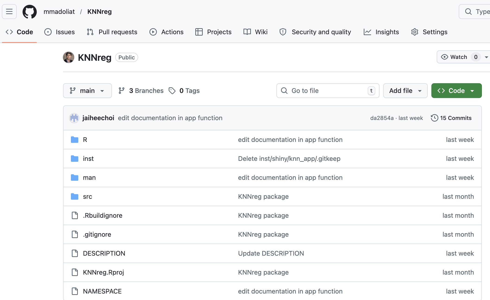

# Why Version Control?

::: incremental
-   Track and restore changes in code over time
-   Collaborate without overwriting others' work
-   Revert to earlier working versions if bugs appear
:::

. . .

Tools Used:

::: incremental
-   `git` (local)
-   `GitHub` (remote)
-   `RStudio` (IDE)
:::

. . .

# Example: KNNreg Package Github {transition="zoom"}

{fig-align="left" fig-alt="Screenshot of Pagerank" width="95%"}

## Git & GitHub Basics

::: incremental
-   **Git**: Version control system for your local project\
-   **GitHub**: Cloud platform to share and collaborate
:::

. . .

Key Terms:

::: incremental
-   **Commit** = Savepoint
-   **Push/Pull** = Send/Receive changes
-   **Repo** = Project folder
:::

. . .

> Example: You push your R package to GitHub, allowing your coauthor to edit documentation and submit a pull request.

## Installing Git

::: incremental
-   Go to [git-scm.com](https://git-scm.com/downloads)
-   Choose your operating system:
    -   **Windows**: Download `.exe` and install with default options
    -   **macOS**: Install via Homebrew `brew install git` or **Git installer**
    -   **Linux**: Use package manager, e.g.:
:::

. . .

``` bash
  sudo apt install git
```

## Verifying Git Installation

Run this in your Terminal (or Command Prompt):

``` bash
git --version
```

. . .

You should see something like:

``` text
git version 2.43.0
```

. . .

> If this works, Git is installed correctly!

## Configuring Git Identity

Set your global Git identity:

``` bash
git config --global user.name "Your Name"
git config --global user.email "you@example.com"
```

. . .

To check the name or email currently set in Git, use these commands:

``` bash
git config --global user.name 
git config --global user.email 
```

## Connect GitHub to R (Create PAT)

1.  In R:

``` r
usethis::create_github_token()
```

::: incremental
2.  GitHub will open — generate a Personal Access Token (PAT)
3.  Copy the token (only shown once!)
4.  Back in R:
:::

. . .

``` r
gitcreds::gitcreds_set()
```

Paste your token when prompted.

. . .

> You’ve now authenticated GitHub from R!

## Check Setup

Use this helpful diagnostic tool:

``` r
usethis::git_sitrep()
```

. . .

This tells you:

::: incremental
-   Whether Git is installed
-   Whether GitHub is connected
-   If PAT is stored
:::

## Creating a New Git-Enabled Project

In RStudio:

::: incremental
1.  **File → New Project**
2.  Choose: **New Directory** → **R Package** (or **New Project**)
3.  Check the box: "Create a git repository"
4.  Finish project setup
:::

. . .

> A `.git` folder is created — this is a Git repo!

## Connect to GitHub

Run this to create and link a GitHub repo:

``` r
usethis::use_github()
```

This will:

::: incremental
-   Push your project to GitHub
-   Open the new repo in your browser

You can now push/pull changes from RStudio Git tab
:::

# Common Git Workflow

::: incremental
1.  Edit `R/stats_module.R`\
2.  Pull → Stage → Commit → Push\
3.  Repeat
:::

. . .

What each step means:

::: incremental
-   Pull: get latest changes from GitHub
-   Stage: select changes to include
-   Commit: save a snapshot with a message
-   Commit: save a snapshot with a message
:::

. . .

## Good Commit Messages

::: incremental
> "Add function documentation to knn_pred()"

-   specific\
-   explains what changed\
-   useful for future you and collaborators
:::

. . .

Common Mistakes:

::: incremental
-   Committing everything without checking

-   Vague messages like "fix" or "updates"

-   Forgetting to pull before starting work
:::

. . .

## Working with Branches

::: incremental
Git branch: a separate “copy” of your project’s code where you can safely make changes without affecting the main version.

Branches let you:

-   Work on features without breaking main code

-   Try experiments safely

-   Collaborate in parallel
:::

## Branch Workflow

::: incremental
1.  Create a branch (e.g. `add-visual`)\
2.  Edit code on branch\
3.  Commit changes\
4.  Push branch to GitHub\
5.  Open Pull Request (PR)\
6.  Merge into main
:::

## Summary of Branching

::: incremental
-   **main** → stable version of your project
-   **branch** → experimental workspace
-   **merge** → combine changes into main
:::

. . .

Branching is helpful because:

::: incremental
-   Prevents breaking working code
-   Makes collaboration easier
-   Keeps project history clean
-   Enables review before merging
:::

. . .

## Github Summary

::: {style="font-size: 130%;"}
**Daily workflow:**

Pull → Edit → Stage → Commit → Push

 

 

**For new features:**

Branch → Edit → Commit → Push

→ Open Pull Request → Merge
:::

# Resources & Further Reading

-   **Happy Git & GitHub for the useR**: <https://happygitwithr.com/>
-   **usethis**: <https://usethis.r-lib.org>
-   **GitHub Docs**: workflows, Actions, projects

# Thank you!

Questions & Discussion
