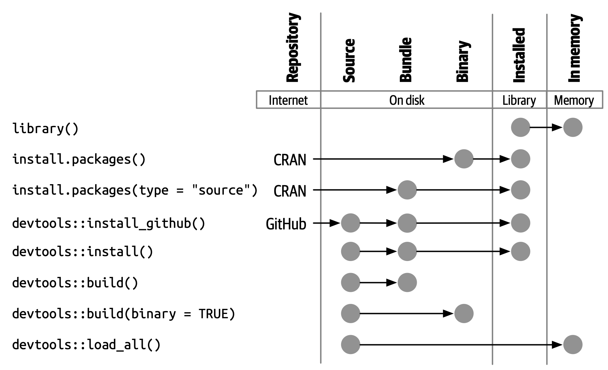
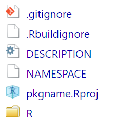
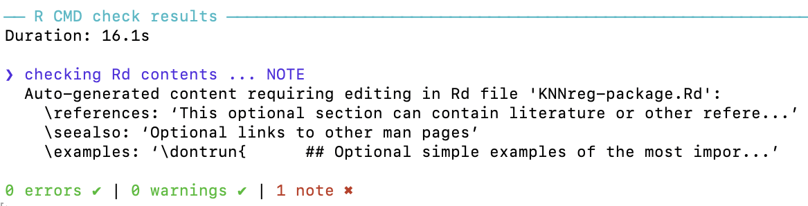
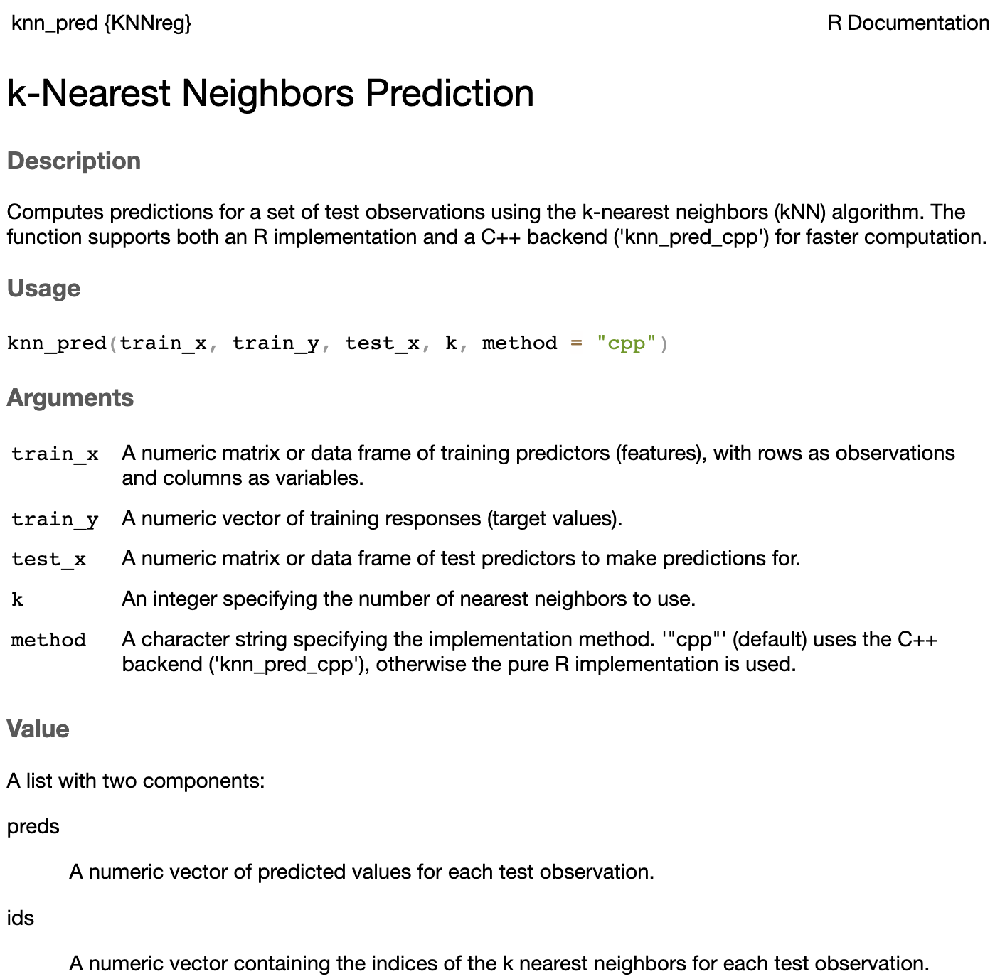

# Outline {transition="slide"}

::: incremental
-   Why Build an R Package?
-   System Setup
-   Package Structure
-   Package States in R
-   Create a Package
-   Functions & Documentation
-   Writing Functions and Documenting
-   Build a Simple Package from Scratch
:::

## 📦 R Packages: The Fundamental Unit

In R, the **fundamental unit of shareable code** is the **package**.

A package bundles together:

::: incremental
-   🧑‍💻 Code\
-   📊 Data\
-   📚 Documentation\
-   🧪 Tests\
:::

. . .

➡️ All in one place, easy to share with others.

## 📦 You Already Use Packages!

If you’re here, you already know how to work with packages:

::: incremental
-   📥 Install a package from CRAN:

    ``` r
    install.packages("x")
    ```

-   ▶️ Use a package in R:

    ``` r
    library("x")
    ```

-   ❓ Get help on them with

    ``` r
    package?x
    help(package = "x")
    ```
:::

## 🎯 Goal of This Talk

This workshop is about moving from **using packages** ➡️ to **developing your own**.

. . .

**Why?**

::: incremental
-   🚀 To share your code with others\
-   📦 To make your code easy to install, use, and learn\
-   ⏳ To save yourself time with conventions and structure
:::

# System Setup

Make sure you have:

::: incremental
-   🛠 The latest version of **R**.
-   🛠 The latest version of **RStudio**.
:::

::: {.fragment .fade-up}
**📦 Required Packages:**

Install the essential development tools:

``` r
install.packages(c("devtools", "roxygen2", "testthat", "knitr"))
```
:::

## 📦 Key Packages

::: incremental
-   **`devtools`**: Simplifies package development by wrapping complex workflows into easy commands

-   **`roxygen2`**: Generates documentation from special comments in your function code

-   **`testthat`**: Provides a framework for unit testing and ensures your functions work correctly and safely over time

-   **`knitr`**: Powers dynamic report generation and vignette building that integrates code, results, and text using R Markdown
:::

::: {.fragment .fade-up}
> 💡 These tools help automate, test, document, and share your package like a pro.
:::

# Package Structure

## 🧩 Directory layout {auto-animate="true"}

``` text
  mypkg/
  ├── DESCRIPTION         # Package metadata
  ├── NAMESPACE           # Exported functions & imports
  ├── R/                  # Your R functions
  └── man/                # Auto-generated documentation
```

::: {.fragment .fade-up}
> 💡 **Tip:** Many folders in an R package are optional and included as needed.
:::

## 🧩 Directory layout {auto-animate="true"}

``` text
  mypkg/
  ├── DESCRIPTION         # Package metadata
  ├── NAMESPACE           # Exported functions & imports
  ├── R/                  # Your R functions
  ├── man/                # Auto-generated documentation
  ├── tests/              # Unit tests with testthat
  ├── vignettes/          # Long-form documentation (Rmd)
  ├── data/               # Data sets (.rda files)
  └── inst/               # Installed files (e.g., app/, extdata/)
```

## 🛠 Package States in R {transition="zoom"}

R packages transition through five development states:

::: incremental
-   🗂️ **Source**: your raw package folder
-   📦 **Bundled**: compressed .tar.gz for sharing
-   🧱 **Binary**: platform-specific precompiled version
-   📚 **Installed**: available in your R library
-   🧠 **In-Memory**: actively loaded via library()
:::

::: {.fragment .fade-up}
> Understanding these states helps you manage installation, sharing, and usage workflows.
:::

## 🗂️ Source Package {transition="zoom"}

A **source package** is just a folder with a specific structure:

-   `DESCRIPTION` file\
-   `R/` folder with `.R` files\
-   Optional: `man/`, `tests/`, `vignettes/`

::: {.fragment .fade-up}
> It’s editable and human-readable — your starting point for development.
:::

## 📦 Bundled Package

A **bundled package** is a compressed `.tar.gz` file created from a source package.

-   Commonly called a **source tarball**
-   Created using `devtools::build()`
-   Platform-independent format for distribution

::: {.fragment .fade-up}
> It acts as a transportable unit — not directly usable until installed.
:::

## 🧱 Binary Package {transition="zoom"}

A **binary package** is a platform-specific compiled package:

-   Windows: `.zip`
-   macOS: `.tgz`
-   Created using `devtools::build(binary = TRUE)`

::: {.fragment .fade-up}
> Ideal for users without development tools — typically distributed by CRAN.
:::

## 📚 Installed Package {transition="zoom"}

An **installed package** is one that’s been unpacked and placed into a library folder.

-   No longer a single file
-   Ready to be loaded into memory

::: {.fragment .fade-up}
> `install.packages()` or `devtools::install_*()` bring packages into this state.
:::

## 🔁 Transitioning Between States {transition="convex"}

{fig-align="center" fig-alt="Screenshot of Pagerank" width="55%"}

# Create a Package

Before creating your R package, you need to choose a **name**.

A valid R package name must:

::: incremental
1.  Contain only **letters**, **numbers**, and **periods (`.`)**
2.  **Start with a letter**
3.  **Not end** with a period
:::

::: {.fragment .fade-up}
❌ You **cannot** use:

-   Hyphens `-`
-   Underscores `_`
:::

## 🛠️ Creating Your Package

Once you have a name, create the package using either:

::: incremental
-   `usethis::create_package("mypkg")`\
-   **RStudio UI**:\
    *File → New Project → New Directory → R Package*
:::

::: {.fragment .fade-up}
👉 Both options run the same function under the hood.
:::

## 📦 What Gets Created?

::::::: columns
:::: {.column width="70%"}
::: incremental
-   `R/` folder → for your function code\
-   `DESCRIPTION` file → metadata\
-   `NAMESPACE` file → exports/imports\
-   `mypkg.Rproj` → RStudio project file\
-   `.Rbuildignore`, `.gitignore` → build and Git helpers
:::
::::

:::: {.column width="30%"}
::: {.fragment .fade-up}
{fig-align="center" fig-alt="Screenshot of Pagerank" width="90%"}
:::
::::
:::::::

## 📄 DESCRIPTION File {auto-animate="true"}

The `DESCRIPTION` file provides overall metadata about your package:

::: incremental
-   Package name and version\
-   Author and maintainer info\
-   Dependencies (`Imports`, `Suggests`)\
-   Description and license\
-   Build-related metadata
:::

## 🧾 Sample DESCRIPTION File {auto-animate="true"}

``` text
Package: KNNreg
Type: Package
Title: k-Nearest Neighbors Regression with Shiny App
Version: 0.0.1
Date: 2026-03-19
Authors@R: c(person("Daniel", "Cirkovic", role = c("aut")), person("Jaihee", "Choi", role = c("aut")), person("Mehdi", "Maadooliat", role = c("aut", "cre"), email = "mehdi.maadooliat@marquette.edu"))
Description: kNN regression functions and an interactive Shiny app.
License: GPL (>= 2)
Imports: Rcpp (>= 1.1.1), shiny, ggplot2
LinkingTo: Rcpp
Encoding: UTF-8
RoxygenNote: 7.3.3
```

::: incremental
-   One paragraph, plain text\
-   Multiple sentences OK\
-   Should describe what the package does
:::

## 🧪 Example from `ggplot2`:

``` text
Title: Create Elegant Data Visualisations Using the Grammar of Graphics
Description: A system for 'declaratively' creating graphics,
  based on "The Grammar of Graphics". You provide the data,
  tell 'ggplot2' how to map variables to aesthetics, what
  graphical primitives to use, and it takes care of the details.
```

## 📦 Imports vs. Suggests

**Imports**

::: incremental
-   Packages required at runtime
-   Automatically installed with your package
-   Needed for core functionality
:::

. . .

**Suggests**

::: incremental
-   Optional or development-time dependencies
-   Used in examples, tests, or vignettes
-   Not required to run the core package
:::

::: {.fragment .fade-up}
> Use `usethis::use_package("pkg", type = "Imports")` to manage these easily.
:::

## 📂 NAMESPACE File

The `NAMESPACE` file defines the **interface** of your package.

It controls:

::: incremental
-   What functions your package **exports**
-   What functions it **imports** from other packages
-   S3/S4 method registrations (if needed)
:::

::: {.fragment .fade-up}
> This file is auto-generated by **roxygen2**, so you typically don’t edit it by hand.
:::

## 🧾 Example: NAMESPACE File

``` text
# Generated by roxygen2: do not edit by hand

export(knn_pred)
export(run_knn_app)
import(ggplot2)
importFrom(Rcpp,evalCpp)
importFrom(shiny,runApp)
useDynLib(KNNreg, .registration = TRUE)
```

. . .

-   `export()` — makes a function available to users

-   `import()` — brings in all exported objects from a package

-   `importFrom()` — imports specific functions

-   `useDynLib()` — links compiled code (C/C++/Fortran) to your package. Required when your package uses compiled routines (e.g., via `Rcpp`)

## ✍️ How to Generate NAMESPACE

In `.R` files:

``` r
#' @export
r_func <- function(x) { ... }
```

. . .

In `.cpp` files:

``` cpp
// [[Rcpp::export]]
double myRcpp-func(int x, double y) { ... }
```

# Functions & Documentation

To add functionality to your package, you’ll write:

::: incremental
-   ✅ Functions — saved as `.R` scripts in the `R/` folder\
-   📝 Documentation — using **roxygen2** comments above each function
:::

::: {.fragment .fade-up}
> Let’s walk through the process.
:::

## 📂 Code Placement

All your functions go in the `R/` folder.

``` text
mypkg/
├── R/
│   ├── my_function.R
│   └── helpers.R
```

Each `.R` file can contain one or more functions.

## 📝 Documenting Functions with Roxygen2

Use special comments starting with `#'` to write function documentation:

``` r
#' Sum of Square Function
#'
#' This function computes the Sum of Squares of a numeric vector
#' 
#' @param x Numeric vector
#' @return Numeric sum of x
#'
#' @examples
#' x <- 1:5
#' y <- my_function(x)
#' print(y)
#'
my_function <- function(x) sum(x^2)
```

This will generate help files in the **man/** folder.

## ⚙️ Generate Documentation

After writing your function and roxygen2 comments, run:

``` r
devtools::document()
```

This will:

::: incremental
-   Update the NAMESPACE file

-   Create `.Rd` help files in the man/ folder
:::

::: {.fragment .fade-up}
💡 You can also press `Ctrl+Shift+D` in RStudio.
:::

# Build a Simple Package from Scratch

We will be using the knn_pred() function from our previous lessons to build an R package that incorporates Rcpp as well.

::: incremental
-   Step 1: Create Your Package

-   Step 2: Add a Dataset

-   Step 3: Write Your Functions

-   Step 4: Document Your Functions

-   Step 5: Load and Check the Package

-   Step 6: Build and Install the Package 
:::
## 1️⃣ Create Your Package

Use `usethis` to create a new package directory:

``` r
usethis::create_package("KNNreg")
```

This creates:

::: incremental
-   **R/, DESCRIPTION, NAMESPACE**

-   `.Rproj`, `.gitignore`, `.Rbuildignore`

-   Opens new RStudio project for your package
:::

## 2️⃣ Add a Dataset

Let’s include a built-in dataset (mtcars) for simplicity:

``` r
usethis::use_data(mtcars, overwrite = TRUE)
```

. . .

This creates a **data/mtcars.rda** file — accessible via

``` r
minipkg::mtcars
```

## 3️⃣ Write Your Functions {.incremental}

-   Create function files in the R/ folder.

-   Keep important functions in separate files.

-   Place helper functions together in a single file.

-   This structure keeps your project organized and maintainable.

Create a new file: **R/knn_pred.R**

``` {.r code-line-numbers="1-1|2-5|7-13|15-22|24-39|41-43"}
knn_pred <- function(train_x, train_y, test_x, k) {
  # Coerce types
  train_x <- as.matrix(train_x)
  test_x  <- as.matrix(test_x)
  train_y <- as.numeric(train_y)

  # Scale train and test appropriately
  train_x <- scale(train_x)
  # Extract the mean and sd used
  train_mean <- attr(train_x, "scaled:center")
  train_sd <- attr(train_x, "scaled:scale")
  # Apply the same transformation to test data
  test_x <- scale(test_x, center = train_mean, scale = train_sd)

  n <- nrow(train_x)
  p <- ncol(train_x)
  m <- nrow(test_x)

  # Store predictions
  preds <- numeric(m)
  # Store ids of k nearest neighbors
  ids <- numeric(m * k)

  for (j in seq_len(m)) {

    # Squared Euclidean distances using matrix ops (fast):
    # t(train_x) is p x n; subtract p-vector test_x[j,]; colSums -> length n
    dists <- colSums((t(train_x) - test_x[j, ])^2)

    # Indices of k smallest distances (full sort, simple & reliable)
    idx_k <- order(dists)[seq_len(k)]

    # Mean of neighbor labels
    preds[j] <- mean(train_y[idx_k])

    # Store ids of nearest neighbors
    # ids of vars
    ids[((j-1) * k + 1):(j * k)] <- idx_k
  }

  out = list("preds" = preds, "ids" = ids)

  out
}
```

## 4️⃣ Document Your Functions

Run the following command to generate docs:

``` r
devtools::document()
```

This will:

::: incremental
-   Add `export(knn_pred)` to your **NAMESPACE**

-   Create **man/knn_pred.Rd**
:::

## 5️⃣ Load and Test the Package

In the console:

``` r
devtools::load_all()
```

::: {.fragment .fade-up}
Check to make sure there are no issues with your package compiling:

``` r
devtools::check()
```
:::
::: {.fragment .fade-up}
The output will look like:

{fig-align="center" fig-alt="Screenshot of Pagerank" width="75%"}
:::


## 6️⃣ Build and Install the Package

Build the package locally:

``` r
devtools::build()
```

::: {.fragment .fade-up}
Install it:

``` r
devtools::install()
```
:::

::: {.fragment .fade-up}
Now you can use it like any other package:

``` r
library(KNNreg)

# Simulate training and test data
train_x <- matrix(rnorm(50), nrow = 10)
train_y <- rnorm(10)
test_x <- matrix(rnorm(20), nrow = 4)

# Set number of nearest neighbors
k <- 3

# Run the kNN algorithm
knn_pred(train_x, train_y, test_x, k, method = "cpp") # test C++ backend
```
:::

## 🚀 `help("knn_pred")` {transition="convex"}

{fig-align="center" fig-alt="Screenshot of Pagerank" width="55%"}

# Hands-on Exercises (30 min)

::: incremental
1.  Create a new package skeleton and add a simple function
2.  Write roxygen docs and generate help files
:::


# Submitting Your Package to CRAN

::: incremental
1.  CRAN Submission: Overview
2.  Requirements Before Submission
3.  Handling NOTEs and WARNINGs
4.  Simulate a CRAN Check
5.  Submit to CRAN
6.  Collaborate via GitHub
:::

# 1. CRAN Submission: Overview

CRAN is the **Comprehensive R Archive Network** — the main repository for R packages.

Submitting to CRAN means:

::: incremental
-   ✅ Your package is publicly available
-   🧪 It passes strict quality checks
-   🌍 It becomes accessible via `install.packages("yourpkg")`
:::

# 2. Requirements Before Submission

Make sure your package:

::: incremental
-   Passes `R CMD check` with **no ERRORs**, **no WARNINGs**, and **no (avoidable) NOTEs**
-   Has proper documentation for all exported functions
-   Has a valid `LICENSE`
-   Uses a CRAN-acceptable package name
-   Has examples that run in \< 5 seconds
:::

. . .

Run:

``` r
devtools::check()
```

# 3. Handling NOTEs and WARNINGs

Some NOTEs are common (e.g., missing author ORCID), but…

::: {.fragment .fade-up}
> ❗ Never submit to CRAN with unaddressed **ERRORs** or **WARNINGs**
:::

. . .

To reduce NOTEs:

::: incremental
-   Add your ORCID via `Authors@R`
-   Ensure `Title` and `Description` are plain text
-   Avoid using `cat()` or `print()` in package code unless essential
:::

# 4. Simulate a CRAN Check 🧪

Use `rhub` to simulate CRAN checks on different platforms:

``` r
rhub::check_for_cran()
```

Or test specific platforms:

. . .

``` r
rhub::check(platform = "windows-x86_64-release")
```

. . .

✅ This helps catch issues that only appear on Windows or macOS.

# 5. Submit to CRAN

Use the `devtools` helper:

``` r
devtools::release()
```

This will:

::: incremental
-   Check your package one final time
-   Ask you to confirm
-   Open the CRAN web form in your browser
-   Help generate an email to CRAN maintainers
:::

## 📬 What Happens After Submission?

::: incremental
-   You’ll get an automated confirmation email
-   Within \~24–72 hours, a CRAN maintainer will review your package
:::

. . .

-   They may:
    -   Accept it immediately ✅
    -   Request fixes or clarifications ✍️
    -   Reject with detailed reasons ❌

## 🔄 Updating a CRAN Package

To submit an update:

::: incremental
-   Bump the version (e.g., from 1.0.0 → 1.0.1)
-   Add a clear `NEWS.md` entry
-   Ensure compatibility with current R version and dependencies
-   Follow the same submission process
:::

::: {.fragment .fade-up}
📌 You can only submit **once every 1–2 weeks** (per package).
:::


# Resources & Further Reading

-   **Books**: *R Packages* by Hadley Wickham (<https://r-pkgs.org>)
-   **devtools**: <https://devtools.r-lib.org>
-   **usethis**: helper functions
-   **CRAN Repository Policy**: CRAN manual

# 🙏 Thank you!

Questions & Discussion
